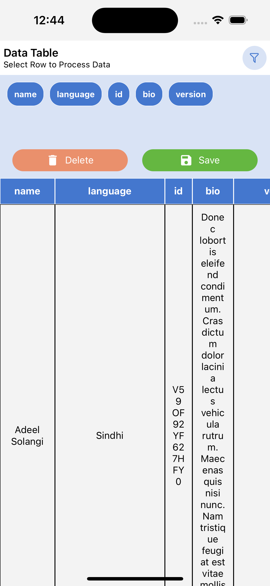

# React Native Dynamic Table

`react-native-dynamic-table` is a React Native component that allows you to create dynamic and customizable tables in your mobile applications. It provides a flexible and easy-to-use interface for rendering tables with varying numbers of rows and columns.

## Installation

```bash
npm install react-native-dynamic-table
```

## Usage/Examples

```javascript
import Component from "my-project";

function App() {
  return (
    <Table
      data={[{ id: "1", name: "Rajkumar" }]}
      onRowPress={function (row: Record<string, any>): void {
        console.log(row);
      }}
      heading={"Data Table"}
      description={"Select Row to Process Data"}
    />
  );
}
```

## Screenshots


